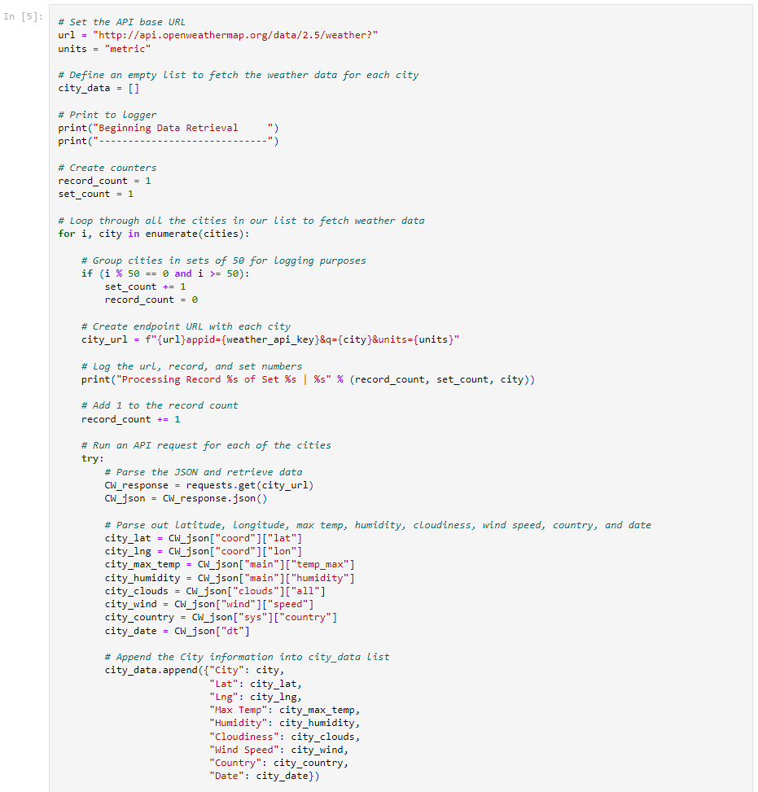
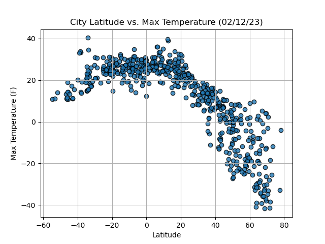
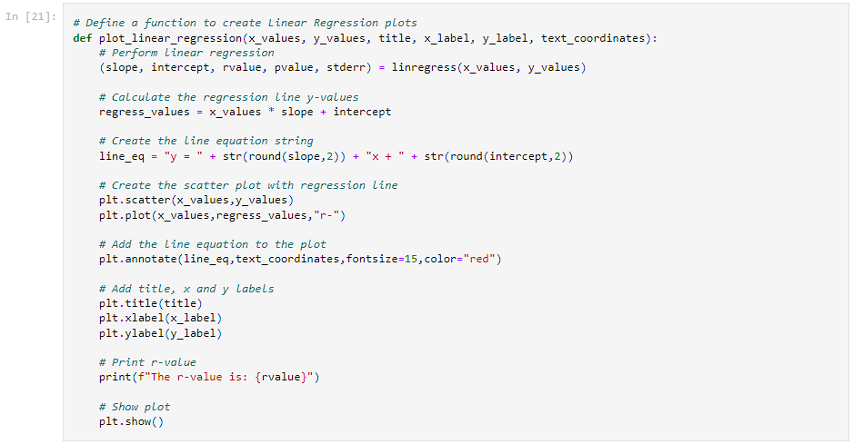
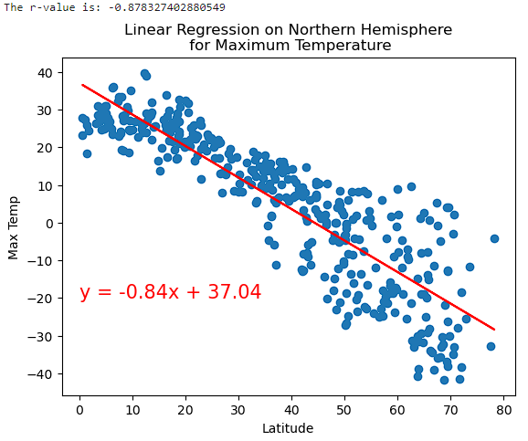
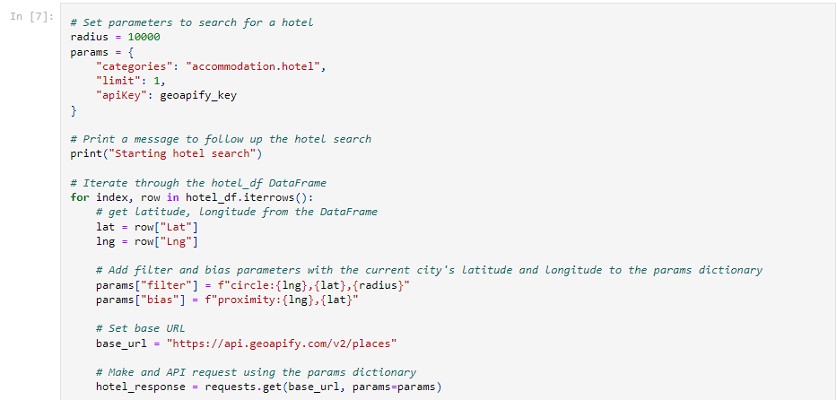

# Geoapify and OpenWeatherMap APIs in Gathering Place and Weather Data

### Utilization of API calls to gather geospacial data, transform, load as plots and map renders using GeoViews

## Background
> Data's true power is its ability to definitively answer questions. So, let's take what you've learned about Python requests, APIs, and JSON traversals to answer a fundamental question: "What is the weather like as we approach the equator?"

> Now, we know what you may be thinking: “That’s obvious. It gets hotter.” But, if pressed for more information, how would you prove that?

## WeatherPy Instructions
> In this deliverable, you'll create a Python script to visualize the weather of over 500 cities of varying distances from the equator. You'll use the citipy Python library Links to an external site., the  OpenWeatherMap API Links to an external site., and your problem-solving skills to create a representative model of weather across cities.

> Requirement 1: Create Plots to Showcase the Relationship Between Weather Variables and Latitude
To fulfill the first requirement, you'll use the OpenWeatherMap API to retrieve weather data from the cities list generated in the starter code. Next, you'll create a series of scatter plots to showcase the following relationships:

- Latitude vs. Temperature

- Latitude vs. Humidity

- Latitude vs. Cloudiness

- Latitude vs. Wind Speed

> Requirement 2: Compute Linear Regression for Each Relationship
To fulfill the second requirement, compute the linear regression for each relationship. Separate the plots into Northern Hemisphere (greater than or equal to 0 degrees latitude) and Southern Hemisphere (less than 0 degrees latitude). You may find it helpful to define a function in order to create the linear regression plots.

> Next, create a series of scatter plots. Be sure to include the linear regression line, the model's formula, and the r values as you can see in the following image
> You should create the following plots:

- Northern Hemisphere: Temperature vs. Latitude

- Southern Hemisphere: Temperature vs. Latitude

- Northern Hemisphere: Humidity vs. Latitude

- Southern Hemisphere: Humidity vs. Latitude

- Northern Hemisphere: Cloudiness vs. Latitude

- Southern Hemisphere: Cloudiness vs. Latitude

- Northern Hemisphere: Wind Speed vs. Latitude

- Southern Hemisphere: Wind Speed vs. Latitude

> After each pair of plots, explain what the linear regression is modeling. Describe any relationships that you notice and any other findings you may uncover.

# Extract
> In each city of the cities list, an API call URL is generated using the city name, base url, API key in background, and set units. This makes a url similar to `http://api.openweathermap.org/data/2.5/weather?appid=KEY###################&q=City&units=metric` and as each call is made, data is added to a list before being transformed into a DataFrame.

# Transform
> DataFrame is indexed and different columns of data are compared based off the requirements of the exercise. Plots are created for initial visual inspection. Ex:

# Load
> A function is created that we can then plug two variables into and compare them in a plot graph. These graphs will have a regression or line of best fit and show the linear equation.

# Analysis
> Analysis is done for each relationship. Example:
`Discussion about the linear relationship: There is a much stronger corrilation between latitude and temperature in the Northern Hemisphere than the Southern. There are also more data points in the Northern DF. If we account for the difference in the data points and look at the X & Y scales, the outliers in the Southern DF dont look so extreme. In the Northern DF for example, there at 40 lat there are points ranging from -10 to 20 temp, a 30 Delta. They look close to the line of regression while in the southern, the same lat has an extreme of 10 to 35, a 25 Delta. I personally think that that Southern DF plots would be more visually useful inverted with a different color on the same plot as the Northern DF.`

## VacationPy Instructions
> In this deliverable, you'll use your weather data skills to plan future vacations. Also, you'll use Jupyter notebooks, the geoViews Python library, and the Geoapify API.

> Your main tasks will be to use the Geoapify API and the geoViews Python library and employ your Python skills to create map visualizations.

1. Create a map that displays a point for every city in the city_data_df DataFrame as shown in the following image. The size of the point should be the humidity in each city.

2. Narrow down the city_data_df DataFrame to find your ideal weather condition. For example:

- A max temperature lower than 27 degrees but higher than 21

- Wind speed less than 4.5 m/s

- Zero cloudiness

3. Create a new DataFrame called hotel_df to store the city, country, coordinates, and humidity.

4. For each city, use the Geoapify API to find the first hotel located within 10,000 meters of your coordinates.

5. Add the hotel name and the country as additional information in the hover message for each city on the map.

# Extract

# Transform
# Load